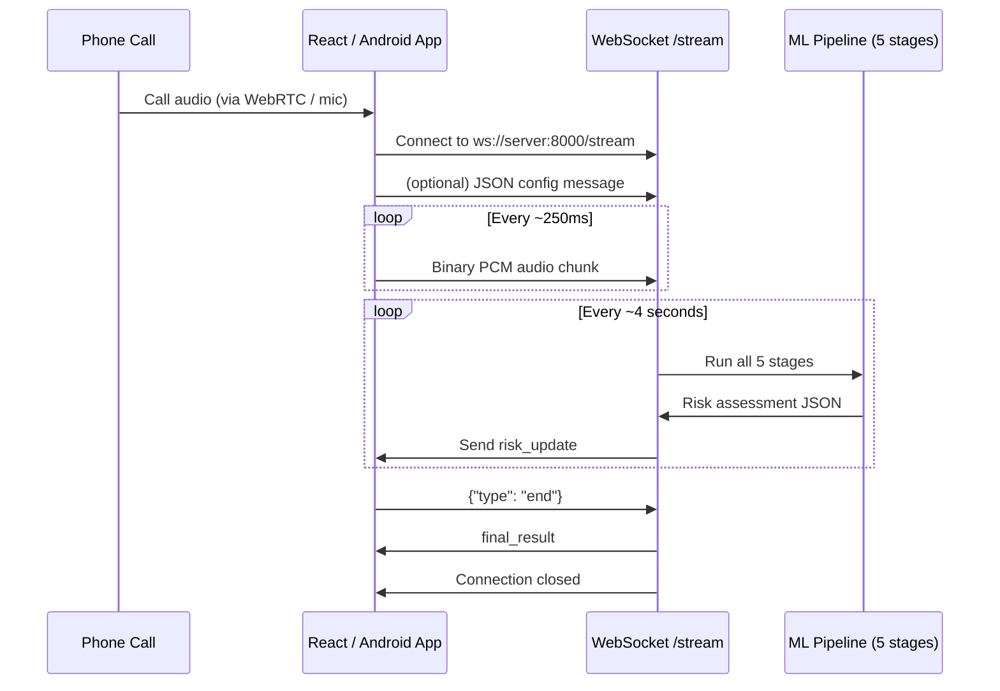

# BharatVoiceGuard — Backend API Reference (for Client Team)

> **Base URL:** `http://<server>:8000`
> **Server:** FastAPI + Uvicorn (running in `ml-pipeline/`)
> **Last updated:** August 2026

---

## Table of Contents

1. [Overview](#overview)
2. [Architecture Flow](#architecture-flow)
3. [Endpoints](#endpoints)
   - [GET /health](#get-health)
   - [POST /analyze (Batch)](#post-analyze-batch)
   - [WS /stream (Live Call)](#ws-stream-live-call)
4. [Response Format](#response-format)
5. [WebSocket Protocol — Full Detail](#websocket-protocol--full-detail)
6. [Client Integration Examples](#client-integration-examples)
7. [Error Handling](#error-handling)
8. [FAQ](#faq)

---

## Overview

The backend exposes two ways to analyze audio:

| Mode | Endpoint | When to use |
|------|----------|-------------|
| **Batch** | `POST /analyze` | Testing, uploading a recorded call file |
| **Live Stream** | `WS /stream` | Real-time analysis during a live phone call |

Both return the **same JSON response format** — the only difference is that `/stream` sends multiple updates as the call progresses.

---

## Architecture Flow



---

## Endpoints

### GET /health

Simple health check.

**Request:**
```
GET /health
```

**Response:**
```json
{"status": "ok"}
```

---

### POST /analyze (Batch)

Upload a complete audio file and get a single risk assessment.

**Request:**
```bash
curl -X POST http://localhost:8000/analyze \
     -F "audio=@path/to/audio.wav"
```

- **Content-Type:** `multipart/form-data`
- **Field name:** `audio`
- **Supported formats:** `.wav`, `.flac`, `.ogg` (any format `soundfile` supports)

**Response:** → [Response Format](#response-format)

---

### WS /stream (Live Call)

> **This is the primary endpoint for production use.**

Real-time audio streaming over WebSocket. The client sends raw PCM audio chunks continuously, and the server sends back updated risk assessments every ~4 seconds.

**Connection:**
```
ws://localhost:8000/stream
```

See [WebSocket Protocol — Full Detail](#websocket-protocol--full-detail) below.

---

## Response Format

Both endpoints return this same JSON structure:

```json
{
  "risk_level": "HIGH_RISK",
  "risk_score": 87,
  "voice_authenticity": 0.21,
  "speaker_match": null,
  "transcript": "Send me the OTP immediately.",
  "intent": ["OTP_REQUEST", "URGENCY"],
  "reasons": [
    "Possible synthetic voice (authenticity 21%)",
    "Otp Request detected",
    "Urgency detected"
  ],
  "recommendation": "Verify the caller independently. Do NOT share OTPs, passwords, or financial details."
}
```

### Field Reference

| Field | Type | Description |
|-------|------|-------------|
| `risk_level` | `string` | `"LOW_RISK"` \| `"MEDIUM_RISK"` \| `"HIGH_RISK"` |
| `risk_score` | `integer` | 0–100. Higher = more suspicious |
| `voice_authenticity` | `float` | 0.0–1.0. How likely the voice is a **real human** (1.0 = definitely real, 0.0 = definitely synthetic) |
| `speaker_match` | `float \| null` | 0.0–1.0 cosine similarity to enrolled voice. `null` if no voice is enrolled |
| `transcript` | `string` | What was said. In `/stream` mode, this **accumulates** over the call |
| `intent` | `string[]` | Short intent tags detected in the transcript (see table below) |
| `reasons` | `string[]` | Human-readable explanations for the risk score |
| `recommendation` | `string` | Actionable guidance for the user |

### Intent Tags

| Tag | Meaning |
|-----|---------|
| `MONEY_REQUEST` | Caller is requesting money or a bank transfer |
| `OTP_REQUEST` | Caller is asking for an OTP or verification code |
| `IMPERSONATION` | Caller claims to be a bank, government, or police official |
| `URGENCY` | Caller is creating pressure to act immediately |
| `THREAT` | Caller is threatening the listener |
| `KYC_REQUEST` | Caller is asking for KYC, account, or banking details |

### Risk Levels — What they mean

| Level | Score Range | UI Suggestion |
|-------|-------------|---------------|
| `LOW_RISK` | 0–30 | Green indicator. "Call appears safe" |
| `MEDIUM_RISK` | 31–60 | Yellow/amber indicator. "Exercise caution" |
| `HIGH_RISK` | 61–100 | Red indicator + alert. "Verify caller independently" |

---

## WebSocket Protocol — Full Detail

### 1. Connect

```javascript
const ws = new WebSocket("ws://localhost:8000/stream");
```

### 2. (Optional) Send Config

Send a JSON text message to configure the audio format. **If you skip this, defaults are used** (16kHz, mono).

```javascript
ws.send(JSON.stringify({
  sample_rate: 16000,   // your audio's sample rate
  channels: 1           // mono (1) or stereo (2)
}));
```

**Server responds:**
```json
{"type": "config_ack", "sample_rate": 16000, "channels": 1}
```

### 3. Stream Audio — Binary Frames

Send raw PCM audio as **binary** WebSocket messages.

**Audio format requirements:**
- **Encoding:** Raw PCM, 16-bit signed integers (`Int16Array` / `int16`)
- **Channels:** Mono (1 channel) preferred. Stereo is auto-downmixed on the server.
- **Sample rate:** 16000 Hz preferred. Other rates are auto-resampled on the server.
- **Chunk size:** Send every 200–500ms of audio. Smaller is fine but wasteful; larger adds latency.

> [!IMPORTANT]
> Do NOT send compressed audio (mp3, opus, aac). Send **raw PCM bytes** only.

### 4. Receive Risk Updates — JSON Text Frames

Every ~4 seconds of received audio, the server sends a JSON text message:

```json
{
  "type": "risk_update",
  "analysis_number": 3,
  "call_duration_sec": 12.0,
  "risk_level": "HIGH_RISK",
  "risk_score": 87,
  "voice_authenticity": 0.21,
  "speaker_match": null,
  "transcript": "Hello, I am calling from the bank. Please share your OTP.",
  "intent": ["IMPERSONATION", "OTP_REQUEST"],
  "reasons": ["Possible synthetic voice (authenticity 21%)", "Impersonation detected", "Otp Request detected"],
  "recommendation": "Verify the caller independently. Do NOT share OTPs, passwords, or financial details."
}
```

**Extra fields on stream responses (not in batch):**

| Field | Type | Description |
|-------|------|-------------|
| `type` | `string` | `"risk_update"` for intermediate updates, `"final_result"` for the last one |
| `analysis_number` | `integer` | Which analysis this is (1, 2, 3, …) — increments every ~4s |
| `call_duration_sec` | `float` | Total seconds of audio received so far |

### 5. End the Call

**Option A — Send an end signal** (preferred, triggers final analysis):
```javascript
ws.send(JSON.stringify({ type: "end" }));
// Server sends one final "final_result" message, then closes
```

**Option B — Just close the connection:**
```javascript
ws.close();
// Server handles cleanup silently
```

### 6. Keepalive / Ping

If the connection might go idle, send periodic pings:
```javascript
ws.send(JSON.stringify({ type: "ping" }));
// Server responds: {"type": "pong"}
```

---

## Client Integration Examples

### React / Web — using AudioWorklet + WebSocket

```javascript
// --- 1. Connect to the backend ---
const ws = new WebSocket("ws://localhost:8000/stream");

ws.onopen = () => {
  console.log("Connected to BharatVoiceGuard");
  // Optional: send config if your sample rate differs
  // ws.send(JSON.stringify({ sample_rate: 48000, channels: 1 }));
};

ws.onmessage = (event) => {
  const result = JSON.parse(event.data);

  if (result.type === "risk_update" || result.type === "final_result") {
    // Update your UI with the risk assessment
    updateRiskDisplay(result.risk_level, result.risk_score);
    updateTranscript(result.transcript);
    updateReasons(result.reasons);
    updateIntentTags(result.intent);

    if (result.risk_level === "HIGH_RISK") {
      showAlert(result.recommendation);
    }
  }
};

ws.onclose = () => console.log("Disconnected from BharatVoiceGuard");

// --- 2. Capture audio from mic/call and send to server ---
async function startStreaming() {
  const stream = await navigator.mediaDevices.getUserMedia({ audio: true });
  const audioContext = new AudioContext({ sampleRate: 16000 });
  const source = audioContext.createMediaStreamSource(stream);

  // Use ScriptProcessor (simpler) or AudioWorklet (better performance)
  const processor = audioContext.createScriptProcessor(4096, 1, 1);
  source.connect(processor);
  processor.connect(audioContext.destination);

  processor.onaudioprocess = (e) => {
    if (ws.readyState !== WebSocket.OPEN) return;

    const float32Data = e.inputBuffer.getChannelData(0);

    // Convert Float32 → Int16 (what the server expects)
    const int16Data = new Int16Array(float32Data.length);
    for (let i = 0; i < float32Data.length; i++) {
      int16Data[i] = Math.max(-32768, Math.min(32767,
        Math.floor(float32Data[i] * 32768)
      ));
    }

    // Send raw PCM bytes
    ws.send(int16Data.buffer);
  };
}

// --- 3. End the call ---
function endCall() {
  ws.send(JSON.stringify({ type: "end" }));
}
```

### Android / Kotlin — sketch

```kotlin
// Using OkHttp WebSocket
val client = OkHttpClient()
val request = Request.Builder().url("ws://server:8000/stream").build()

val ws = client.newWebSocket(request, object : WebSocketListener() {
    override fun onMessage(webSocket: WebSocket, text: String) {
        val result = JSONObject(text)
        when (result.getString("type")) {
            "risk_update", "final_result" -> {
                runOnUiThread {
                    updateRiskUI(
                        riskLevel = result.getString("risk_level"),
                        riskScore = result.getInt("risk_score"),
                        transcript = result.getString("transcript")
                    )
                }
            }
        }
    }
})

// Send audio from AudioRecord
val bufferSize = AudioRecord.getMinBufferSize(16000, CHANNEL_IN_MONO, ENCODING_PCM_16BIT)
val recorder = AudioRecord(MIC, 16000, CHANNEL_IN_MONO, ENCODING_PCM_16BIT, bufferSize)
recorder.startRecording()

thread {
    val buffer = ByteArray(bufferSize)
    while (isRecording) {
        val read = recorder.read(buffer, 0, buffer.size)
        if (read > 0) {
            ws.send(ByteString.of(buffer, 0, read))
        }
    }
}
```

### Python — testing with a WAV file over WebSocket

```python
import asyncio, json, struct
import websockets
import soundfile as sf
import numpy as np

async def test_stream():
    uri = "ws://localhost:8000/stream"
    async with websockets.connect(uri) as ws:
        # Load test audio
        audio, sr = sf.read("testing_audio_files/bonafide/bonafide_01.wav",
                            dtype="int16")

        # Send in 0.5s chunks (simulating real-time)
        chunk_size = sr // 2  # 0.5 seconds
        for i in range(0, len(audio), chunk_size):
            chunk = audio[i:i + chunk_size]
            await ws.send(chunk.tobytes())
            await asyncio.sleep(0.1)  # simulate real-time pace

            # Check for any server messages (non-blocking)
            try:
                response = await asyncio.wait_for(ws.recv(), timeout=0.05)
                result = json.loads(response)
                if result.get("type") in ("risk_update", "final_result"):
                    print(f"[Update #{result['analysis_number']}]")
                    print(f"  Risk: {result['risk_level']} ({result['risk_score']})")
                    print(f"  Transcript: {result['transcript']}")
                    print(f"  Intent: {result['intent']}")
                    print()
            except asyncio.TimeoutError:
                pass

        # Signal end of call
        await ws.send(json.dumps({"type": "end"}))
        final = json.loads(await ws.recv())
        print("=== FINAL RESULT ===")
        print(json.dumps(final, indent=2))

asyncio.run(test_stream())
```

---

## Error Handling

### HTTP Errors (POST /analyze)

| Status | Meaning |
|--------|---------|
| `200` | Success — response body contains the risk assessment |
| `422` | Missing or invalid `audio` field in the form data |
| `500` | Server-side analysis error — check `detail` field for info |

### WebSocket Errors

The server may send a JSON error message:
```json
{"type": "error", "detail": "Analysis failed: ..."}
```

Handle gracefully and consider reconnecting if the connection drops mid-call.

---

## FAQ

**Q: What audio format should I send over WebSocket?**
Raw PCM, 16-bit signed integers, mono, 16kHz. No compression. This is what `AudioWorklet` / `AudioRecord` / WebRTC natively produces.

**Q: Can I send audio at 48kHz instead of 16kHz?**
Yes — send a config message first: `{"sample_rate": 48000, "channels": 1}`. The server auto-resamples to 16kHz internally. But sending at 16kHz saves bandwidth.

**Q: How often do I get risk updates?**
Every ~4 seconds of audio received. This matches the AASIST-L model's optimal input window (64,600 samples ≈ 4.04s at 16kHz).

**Q: Does the transcript reset between updates?**
No — it **accumulates**. Each update contains the full call transcript so far.

**Q: What if the caller is silent?**
The server still accumulates audio. If the ASR produces no text for a window, the transcript stays unchanged and scam intent remains based on whatever was said earlier.

**Q: Is WebRTC used?**
WebRTC is a **client-side** technology for capturing live call audio in the browser or Android app. The captured audio is then sent to this server over a standard **WebSocket**. The server itself does not use WebRTC — it receives raw PCM bytes via WebSocket.

**Q: Can I test without WebRTC?**
Yes — use `POST /analyze` with a recorded audio file, or use the Python WebSocket test script above to simulate a live stream from a WAV file.

**Q: What if the WebSocket disconnects mid-call?**
The server cleans up automatically. The client should reconnect and start a new session. Previous state (transcript, buffer) is lost — this is a prototype limitation.
